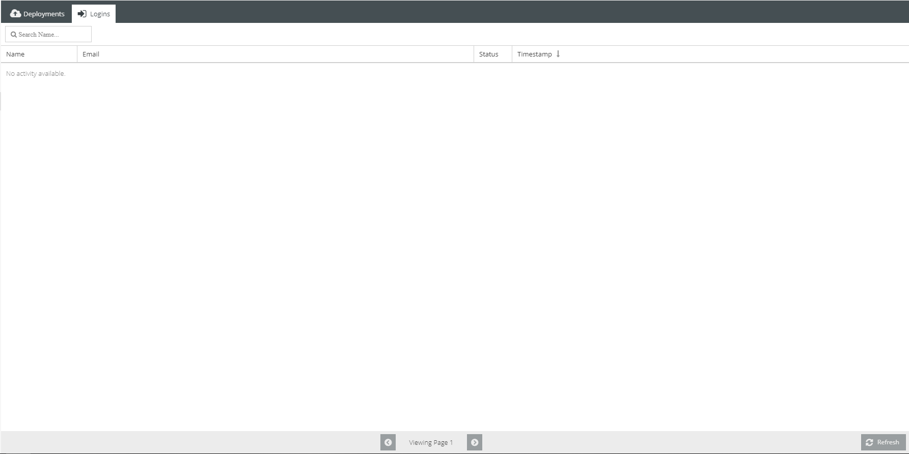

Activity
========

Displays current activity about deployment status' and logins. Information displayed shows device type, the error if one was occurred, who logged in, and when. 

===========
Deployments
===========

.. image:: ./images/activity.png

* Filters

    * Status Filter Button
        
        * Located at top 
        * Searches by `All | Error | Finished`

* Grid
    
    * Displays: 
        
        * Status of Deployment
        * Devices: Alexa and Google
        * Error if occurred
        * Date of Deployment

======
Logins
======

* Filters

    * Search Bar
        
        * Located at top left
        * Filters `names`

* Grid

    * Displays:
        
        * Names
        * Email
        * Status
        * Timestamp

