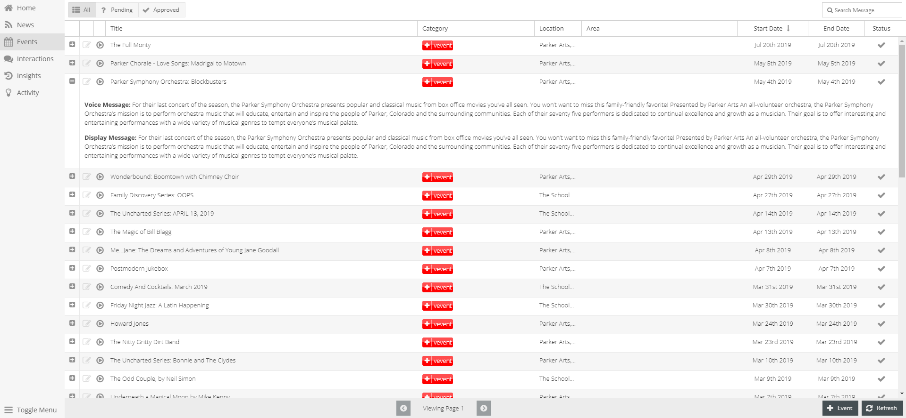
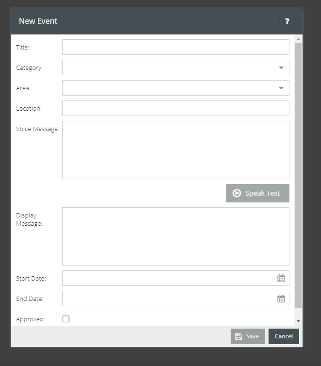

Events
======

Help community members stay updated about current community events. By simply asking the skill what events are happening, a user can be notified of the most recent events taking
place near them. The Events section allows for managers to manually enter events with detailed information. The ability to include iCal Feeds is also available. Similar to News Feed, in Settings -> Events, the manager has the the ability to add calendar feeds. Fill out the required fields and iCal URL and sync events for local calendars automatically. 

===========================
Features Within Events Page
===========================

* "+" Button 
    * Expands view of each event
* Edit Button
    * Allows non-feed events to be edited
* Play Button
    * Allows a sample of story to be heard
* Filter Events By Status
    * Click on buttons on the bottom right of page
        * All | Pending | Approved 
        * View of page will shift to display selected type
* Search Events
    * Searches events by display and voice messages
    * Located to the top right of the Events grid

You can see Events Guides here: :ref:`Events Guides`