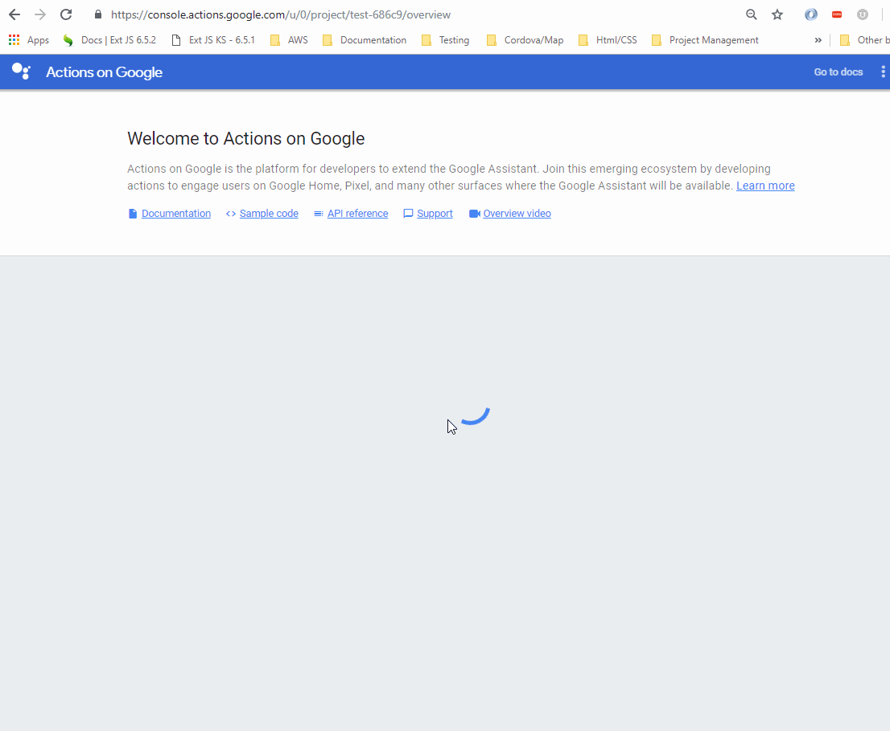
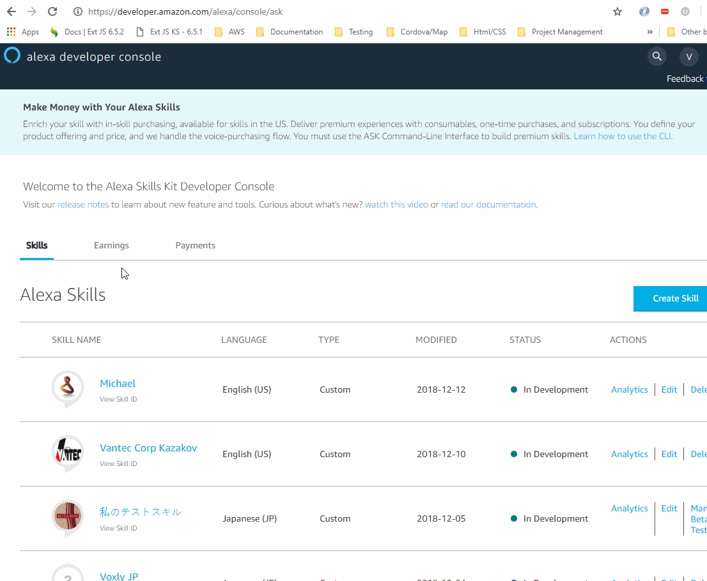

Help
====

To find the Google ID

To start, head to the `Actions on Google. <https://console.actions.google.com/u/0/>`_

This will be the Google ID to be pasted into the General Settings Tab.

To find the Alexa Skill ID

To start, head to the `Alexa Developer. <https://developer.amazon.com/>`_

Then paste it into the General Tab under Settings into the Alexa Skill ID textbox.