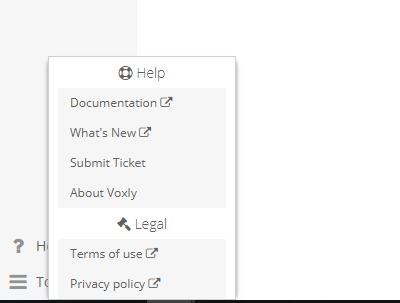

Home
====

Windows throughout the management system will have a question mark button at the top right.

.. image:: ./images/question_mark.png

Clicking this button will redirect the user to the proper documentation page for help, guides, and explanations.

In the bottom left of the management system, a help button will be found linking to the documentation pages.

In the **Features** Section, there will be general information about the manager features and how to use different tools of each section.