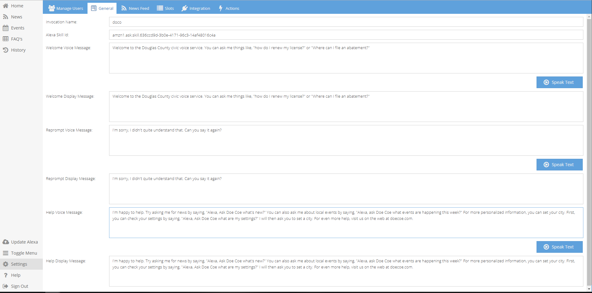
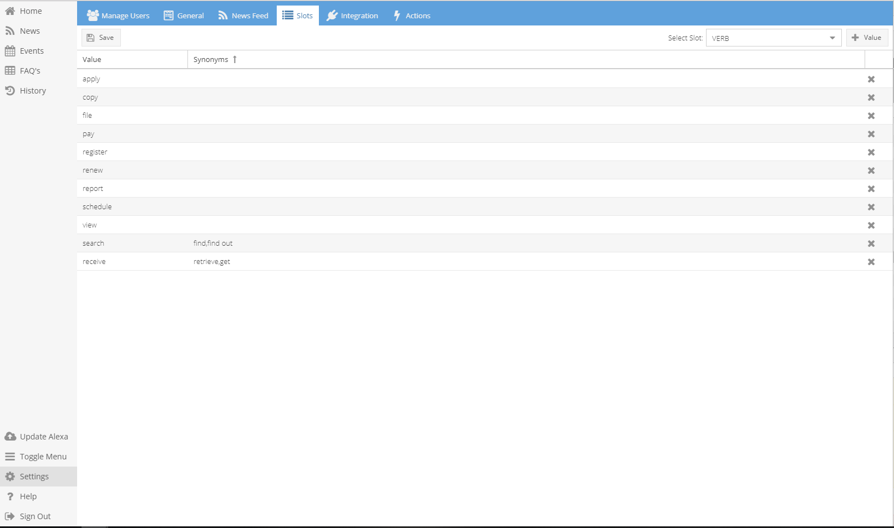

Settings
========

Include paragraph about settings

===========
General Tab
===========

---------------
Invocation Name
---------------

* The invocation name is how your skill will be invoked by users. Also known as wake word.

----------------
Alexa Skill Id
----------------

* This ID is unique to each tennants skill. This is how the lambda will register your specific skill.
* You will enter the skill id associated with the Amazon Alexa skill you have created. 
    * For instructions on setting up your Alexa skill account please see blank section

---------------
Welcome Message
---------------

* This message will be spoken to users upon initially starting the skill. 
* The purpose of this message is to welcome your users and to inform them of the information they can gain through your skill. 

----------------
Reprompt Message
----------------

* This message will be relayed to a user when their questions was not understood. Meaning, Alexa understood she was spoken to but could not make out what was asked.

-------------
Help Message
-------------

* Craft a response to help instruct your users in the most effective way to gain a response from your skill. 
* Best phrases to model or examples of questions they can ask are suggested to use in this message.

-----------------
Speak Text Button
-----------------

* This button allows you test what your message will sound like. 

*Note:Voice is what Alexa will speak. Display is what she will show, if using a screen. Please refer to writing section to better understand how to write messages that will be spoken.*

=========
News Feed
=========

.. image:: ./images/NewsFeed.png

-------------
News Feed URL
-------------

* Enter RSS feed in this field. 

-------
Refresh
-------

* You can pick if you would like news updates to refresh on a daily or hourly bases. 
* It is recommended you base the choice off frequency of new content being made available to your community. 

-------------
Empty Message
-------------

* This message is what Alexa Communicates wheen there  is no new content to give. 

----------------
Days to Refernce
----------------

* Allows Alexa to search further than the day content was requested, upon finding no new content for that day.

-----------
Remove Text
-----------

* If RSS cuts off a story, this text boxs allows you to construct a message to further direct users.

----------------
Sync Data Button
----------------

* Syns most updated data.

--------------
Clear All Data
--------------

* Clears all data. 

=====
Slots
=====

The primary function of this page is to create values to further be used within your management system. The drop down contains a list of predetermined slot categories,
values to be added will correspond to these categories. This section can best be thought of as a word bank, you are adding words (values) that relate to each category. 
Please see below for futher examples. 

*Exmaple of values created within the Verb slot*

.. image:: ./images/SlotUseExample.png

*Values created within this page will give content to choose from slot categories when creating/editing FAQs and Events*

---------
Add Value
---------

    #. Select the Slot you would like to enter value within. 
        * This step only needs to be done when if value being entered does not belong in current slot choosen. 
    #. Click "+ Value" (top right)
        *  A new row will appear.
    #. Fill out Value field 
        * This field is dependent of the slot. This Value can be a verb (find, search...etc.), the name of a city or county, a department or office of the city/county. . .etc.
        * To add a synonym click within the snynonym colum next to the desired value. After typing the word click the comma key to finish adding synonym. 
            *Synonyms can help address a greater range of ways a user may ask a question.* 
    #. Click Save (top left)

------------
Delete Value 
------------
    * Click the "X" at the end of the row of the desire value.
    
        *When mouse hovers over "X" Delete Entry will appear*

--------------
Delete Synonym
--------------
    * Click desired synonym colum
    * Xs will appear net to synonyms. Click on the X of the synonym(s) you owuld like to delete. 

------------
Update Alexa
------------

* Once there is at least once value in each slot category you can update Alexa.
* This update allows the skill to be built and testing to commence. 

===========
Integration
===========

* If you have your own open source connectors they can be input here. 
    #. Click add
    #. Select account type
    #. Input information for data to be queried 

    *Specific to helping pull events and FAQ information*

