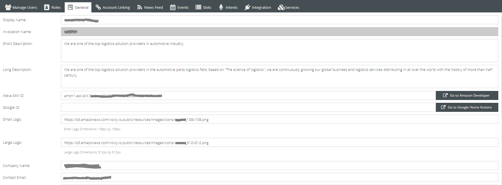
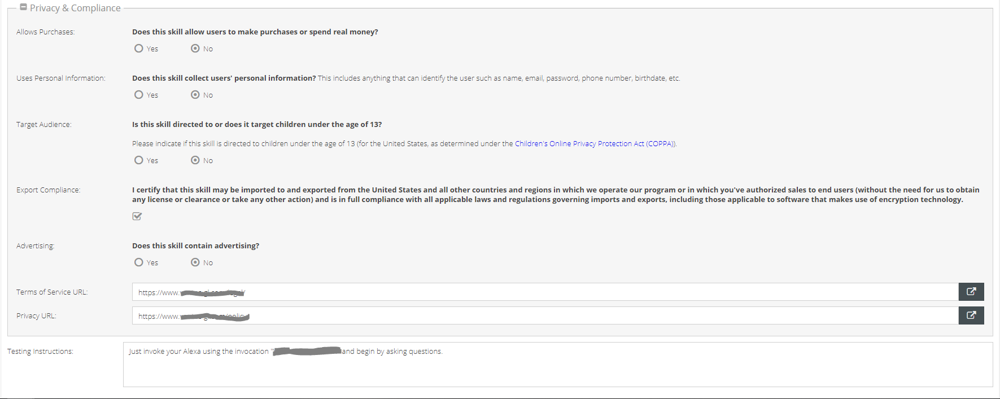
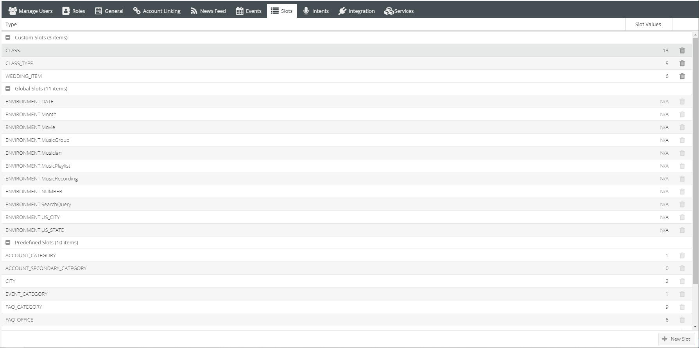
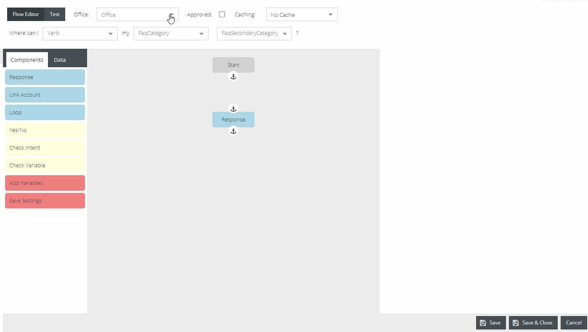

Settings
========

Include paragraph about settings

===========
General Tab
===========

.. image:: ./images/settings_general_2.png

---------------
Invocation Name
---------------

* The invocation name is how the skill will be invoked by users. Also known as wake word. It is recommended to make the invocation name two words.

-------------------------
Alexa Skill and Google ID
-------------------------

* This ID is unique for each tenants' skill. This is how the server will register a specific skill.
*  Enter the skill ID associated with the Amazon Alexa skill that was created.

*For instructions on setting up the Alexa skill account please see blank section*

----------------
Reprompt Message
----------------

* This message will be relayed to a user when their questions was not understood. Meaning, Alexa understood she was spoken to but could not make out what was asked.

-----------------
Speak Text Button
-----------------

* This button allows a manager to test what the voice message will sound like. 

*Note:Voice is what Alexa will speak. Display is what she will show, if using a screen. Please refer to writing section to better understand how to write messages that will be spoken.*

=========
News Feed
=========

.. image:: ./images/news_feed.png

-------------
News Feed URL
-------------

* Enter RSS feed in this field. 

-------
Refresh
-------

* Ability to refresh news has options for daily or hourly. 
* It is recommended the frequently refresh new content being made available to the community. 

-------------
Empty Message
-------------

* This message is what Alexa Communicates when there  is no new content to give. 

-----------------
Days to Reference
-----------------

* Allows Alexa to search further than the day content was requested, upon finding no new content for that day.

-----------
Remove Text
-----------

* If RSS cuts off a story, this text box allows for a custom message to direct users further.

----------------
Sync Data Button
----------------

* Sync most updated data.

--------------
Clear All Data
--------------

* Clears all data. 

=====
Slots
=====

The primary function of this page is to create values to further be used within the management system. The drop down contains a list of predetermined slot categories,
values to be added will correspond to these categories. This section can best be thought of as a word bank, adding words (values) that relate to each category. 
Please see below for further examples. 

*Example of values created within the Verb slot*

*Values created within this page will give content to choose from slot categories when creating/editing FAQs and Events*

See Slots Settings Guides here: :ref:`Settings Guides`

===========
Integration
===========

* If their are open source connectors, they can be added under Integration. 
    #. Click add
    #. Select account type
    #. Input information for data to be queried 

    *Specific to helping pull events and FAQ information*

============
Manage Users
============

=====
Roles
=====

==========
Events Tab
==========

=======
Intents
=======

========
Services
========