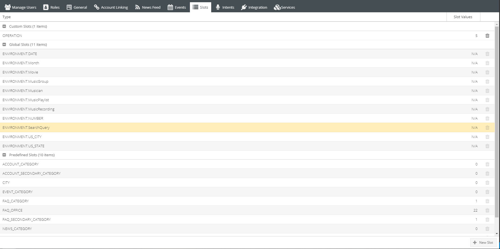
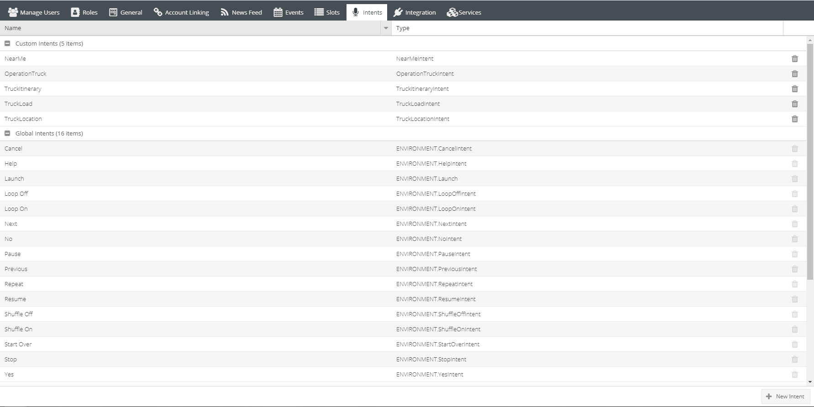

Settings Guides
===============

============
Create Slots
============

---------
Add Value
---------

    #. Select the Slot you would like to enter value within. 
        * This step only needs to be done when if value being entered does not belong in current slot choosen. 
    #. Click "+ Value" (top right)
        *  A new row will appear.
    #. Fill out Value field 
        * This field is dependent of the slot. This Value can be a verb (find, search...etc.), the name of a city or county, a department or office of the city/county. . .etc.
        * To add a synonym click within the snynonym colum next to the desired value. After typing the word click the comma key to finish adding synonym. 
            *Synonyms can help address a greater range of ways a user may ask a question.* 
    #. Click Save (top left)

------------
Delete Value 
------------
    * Click the "X" at the end of the row of the desire value.
    
        *When mouse hovers over "X" Delete Entry will appear*

--------------
Delete Synonym
--------------
    * Click desired synonym colum
    * Xs will appear net to synonyms. Click on the X of the synonym(s) you owuld like to delete. 

------------
Update Alexa
------------

* Once there is at least once value in each slot category you can update Alexa.
* This update allows the skill to be built and testing to commence.

-------------
Settings Slot
-------------

==============
Create Intents
==============

